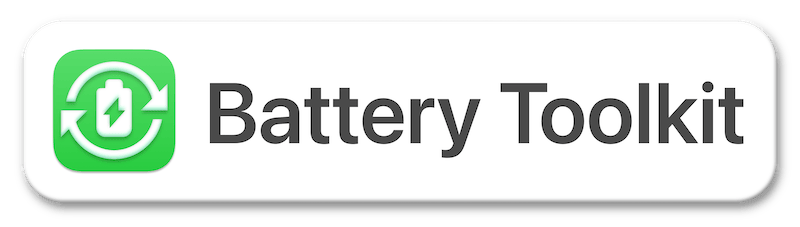
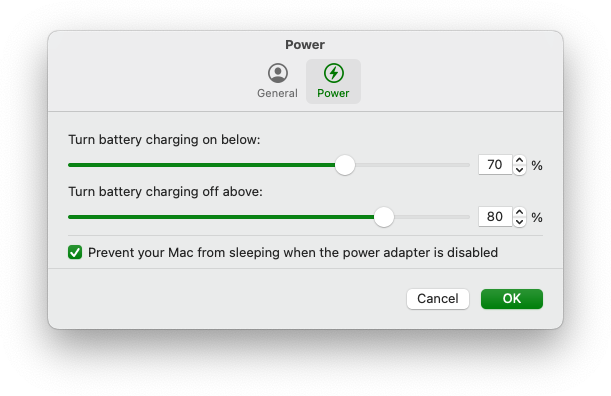
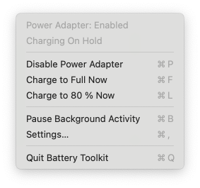
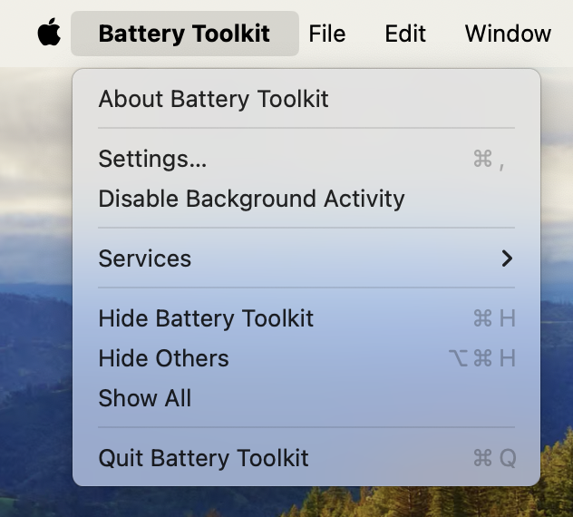
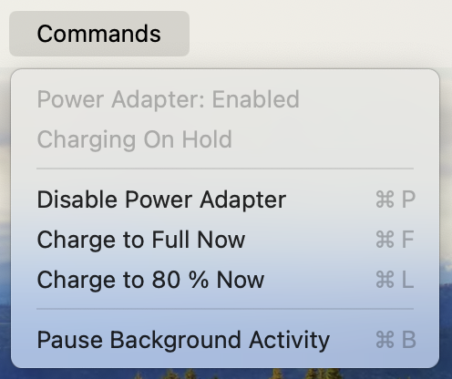

 

Control the platform power state of your Apple Silicon Mac.

<a href="#features">Features</a> &bull; <a href="#install">Install</a> &bull; <a href="#usage">Usage</a> &bull; <a href="#uninstall"> Uninstall </a> &bull;<a href="#limitations"> Limitations </a> &bull; <a href="#technical-details"> Technical Details </a>

-----

# Features

## Limits battery charge to an upper limit

Modern batteries deteriorate more when always kept at full charge. For this reason, Apple introduced the “Optimized Charging“ feature for all their portable devices, including Macs. However, its limit cannot be changed, and you cannot force charging to be put on hold. Battery Toolkit allows specifying a hard limit past which battery charging will be turned off. For safety reasons, this limit cannot be lower than 50&nbsp;%.

## Allows battery charge to drain to a lower limit

Even when connected to power, your Mac's battery may slowly lose battery charge for various reasons. Short battery charging bursts can further deteriorate batteries. For this reason, Battery Toolkit allows specifying a limit only below which battery charging will be turned on. For safety reasons, this limit cannot be lower than 20&nbsp;%.

**Note:** This setting is not honoured for cold boots or reboots, because Apple Silicon Macs reset their platform state in these cases. As battery charging will already be ongoing when Battery Toolkit starts, it lets charging proceed to the upper limit to not cause further short bursts across reboots.

## Allows you to disable the power adapter

If you want to discharge the battery of your Mac, e.g., to recalibrate it, you can turn off the power adapter without actually unplugging it. You can also have Battery Toolkit disable sleeping when the power adapter is disabled.

**Note:** Your Mac may go to sleep immediately after enabling the power adapter again. This is a software bug in macOS and cannot easily be worked around.

||
|:--:| 
| **Fig. 1**. *Power Settings* |

## Grants you manual control

The Battery Toolkit "Commands" menu and its menu bar extra allow you to issue various commands related to the power state of your Mac. These include:
* Enabling and disabling the power adapter
* Requesting a full charge
* Requesting a charge to the specified upper limit
* Stopping charging immediately
* Pausing all background activity

||
|:----------|
| **Fig. 2**. *Menu Bar Extra* |

# Install

> [!IMPORTANT]
> Battery Toolkit currently only supports Apple Silicon Macs [#15](https://github.com/mhaeuser/Battery-Toolkit/issues/15)

### Manual Install
1. Go to the GitHub [releases](https://github.com/mhaeuser/Battery-Toolkit/releases/latest) page
2. Download the latest non-dSYM build (e.g., `Battery-Toolkit-1.6.zip`)
3. Unzip the archive
4. Drag `Battery Toolkit.app` into your Applications folder

### Install via Homebrew :beer:
1. Install [Homebrew](https://brew.sh) if you haven't already
2. Open Terminal and run `brew tap mhaeuser/mhaeuser`
3. Run `brew install battery-toolkit`

You may want to add the `--no-quarantine` flag onto the end of the install command to bypass Gatekeeper more conveniently, but beware the potential security risks of doing so.

Otherwise, follow the steps mentioned below.

### Opening the App
Because Battery Toolkit is not notarized, you will have to manually allow it to open.

On macOS 14 Sonoma or below:
1. Right click `Battery Toolkit.app`
2. Click "Open"
3. Click "Open" in the dialog box

On macOS 15 Sequoia or above:
1. Try to open the app, it will tell you it's blocked
2. Go to `System Settings > Privacy & Security` and scroll to the bottom
3. Click "Open Anyway" to allow Battery Toolkit to open
4. Click "Open Anyway" on the next dialog box and authenticate
5. Open Battery Toolkit again from Applications folder

# Usage

> [!CAUTION]
> To ensure there is no chance of interference, please turn “Optimized Charging” **off** when Battery Toolkit is in use.  
>  Go to macOS System Settings > Battery > the (i) next to Battery Health > Optimized Battery Charging > toggle off

1. Open Battery Toolkit from your Applications folder
2. The menu bar will change to show the app menus, and a menu bar extra will should be visible
3. Configure the settings through either method (see **Fig. 2, 3, 4**)

|||
|:----------|:----------|
| **Fig. 3**. *Main Menu* | **Fig. 4**. *Menu Bar Commands* |

If you prefer, you can quit the GUI to hide the menu bar extra and Battery Toolkit will keep running in the background.
If you want to change any settings, simply re-open the app.

# Uninstall

1. Focus Battery Toolkit
2. Open the main Battery Toolkit menu in the menu bar (see **Fig. 3**)
3. Choose "Disable Background Activity"
4. Move the app to the Trash and empty it

# Limitations

Battery Toolkit disables sleep while it is charging, because it has to actively disable charging once reaching the maximum. Sleep is re-enabled once charging is stopped for any reason, e.g., reaching the maximum charge level, manual cancellation, or unplugging the MacBook.

Apps, including Battery Toolkit, cannot control the charge state when the machine is shut down. If the charger remains plugged in while the Mac is off, the battery will charge to 100&nbsp;%.

Note that sleep should usually be disabled when the power adapter is disabled, as this will exit Clamshell mode and the machine will sleep immediately if the lid is closed. Refer to the toggle in the Settings dialog (see **Fig. 1**).

# Technical Details

* Based on IOPowerManagement events to minimize resource usage, especially when not connected to power
* Support for macOS Ventura daemons and login items for a more reliable experience

## Security
* Privileged operations are authenticated by the daemon
* Privileged daemon exposes only a minimal protocol via XPC
* XPC communication uses the latest macOS codesign features

# Credits
* Icon based on [reference icon by Streamline](https://seekicon.com/free-icon/rechargable-battery_1)
