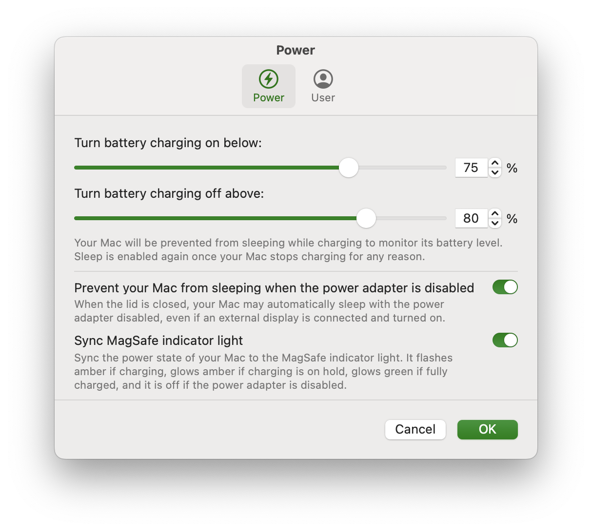

-----

Control the platform power state of your Apple Silicon Mac.

# Features

## Limits battery charge to an upper limit

Modern batteries deteriorate more when always kept at full charge. For this reason, Apple introduced the “Optimized Charging“ feature for all their portable devices, including Macs. However, its limit cannot be changed, and you cannot force charging to be put on hold. Battery Toolkit allows specifying a hard limit past which battery charging will be turned off. For safety reasons, this limit cannot be lower than 50 %.

**Note:** To ensure there is no chance of interference, please turn “Optimized Charging” **off** when Battery Toolkit is in use.

## Allows battery charge to drain to a lower limit

Even when connected to power, your Mac's battery may slowly lose battery charge for various reasons. Short battery charging bursts can further deteriorate batteries. For this reason, Battery Toolkit allows specifying a limit only below which battery charging will be turned on. For safety reasons, this limit cannot be lower than 20 %.

**Note:** This setting is not honoured for cold boots or reboots, because Apple Silicon Macs reset their platform state in these cases. As battery charging will already be ongoing when Battery Toolkit starts, it lets charging proceed to the upper limit to not cause further short bursts across reboots.

## Allows you to disable the power adapter

If you want to discharge the battery of your Mac, e.g., to recalibrate it, you can turn off the power adapter without actually unplugging it. You can also have Battery Toolkit disable sleeping when the power adapter is disabled.

**Note:** Your Mac may go to sleep immediately after enabling the power adapter again. This is a software bug in macOS and cannot easily be worked around.

||
|:--:| 
| *Battery Toolkit Power Settings* |

# Grants you manual control

The Battery Toolkit “Commands“ menu and its menu bar extra allow you to issue various commands related to the power state of your Mac. These include:
* Enabling and disabling the power adapter
* Requesting a full charge
* Requesting a charge to the specified upper limit
* Stopping charging immediately

||
|:--:| 
| *Battery Toolkit Menu Bar Extra* |

# Compatibility

Battery Toolkit currently supports only Apple Silicon Macs.

# How to Install

1. Go to [releases](https://github.com/mhaeuser/Battery-Toolkit/releases)
2. Download the newest non-dSYM build (e.g. Battery-Toolkit-1.5.zip)
3. Unzip it (double click)
4. Drag it into your applications folder
5. Right click the Battery Toolkit app, then click "open"
6. If that's not an option go to system settings -> privacy and security and you should see a prompt at the bottom of the screen allow opening Battery Toolkit. Allow it.
7. Try opening Battery Toolkit again. It should open now.

# Technical details

* Based on IOPowerManagement events to minimize resource usage, especially when not connected to power
* Support for macOS Ventura daemons and login items for a more reliable experience

## Security
* Privileged operations are authenticated by the daemon
* Privileged daemon exposes only a minimal protocol via XPC
* XPC communication uses the latest macOS codesign features

# Credits
* Icon based on [reference icon by Streamline](https://seekicon.com/free-icon/rechargable-battery_1)
